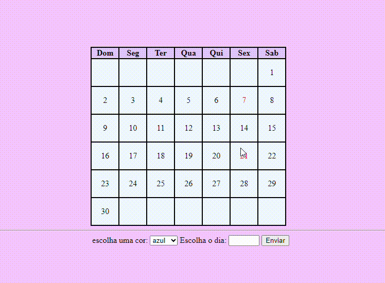

# Índice

[Projeto - Calendario Interativo.](https://github.com/emillycaaroline/calendario#-projeto---calendario-interativo)  
[descrição](https://github.com/emillycaaroline/calendario#-descri%C3%A7%C3%A3o)  
[Funcionalidades](https://github.com/emillycaaroline/calendario#-funcionalidades)    
[Tecnologias Utilizadas](https://github.com/emillycaaroline/calendario#%EF%B8%8F-tecnologias-utilizadas)     
[Autores](https://github.com/emillycaaroline/calendario#%EF%B8%8F-autores)  

#  📅 Projeto - Calendario Interativo.

## 📋 descrição

Repositório criado para a disciplina de Programação I para realização da atividade de criação de calendário iterativo.

## 🔧 Funcionalidades

Este é um calendário interativo, onde se pode escolher uma cor e escolher um dia, depois de enviar automáticamente o dia estará da cor escolhida no calendário.

### 🖇️ Tecnologias Utilizadas
    
   - `github`  
   - `README`
   - `CSS3`
   - `HTML5`
   - `JS`

## ✒️ Autores
[•Emilly Caroline](https://github.com/emillycaaroline)  
[Perfil no Linkedin](https://www.linkedin.com/in/emilly-caroline-129936290)    
[ORIENTADOR=Leonardo Rocha](https://github.com/LeonardoRochaMarista)
